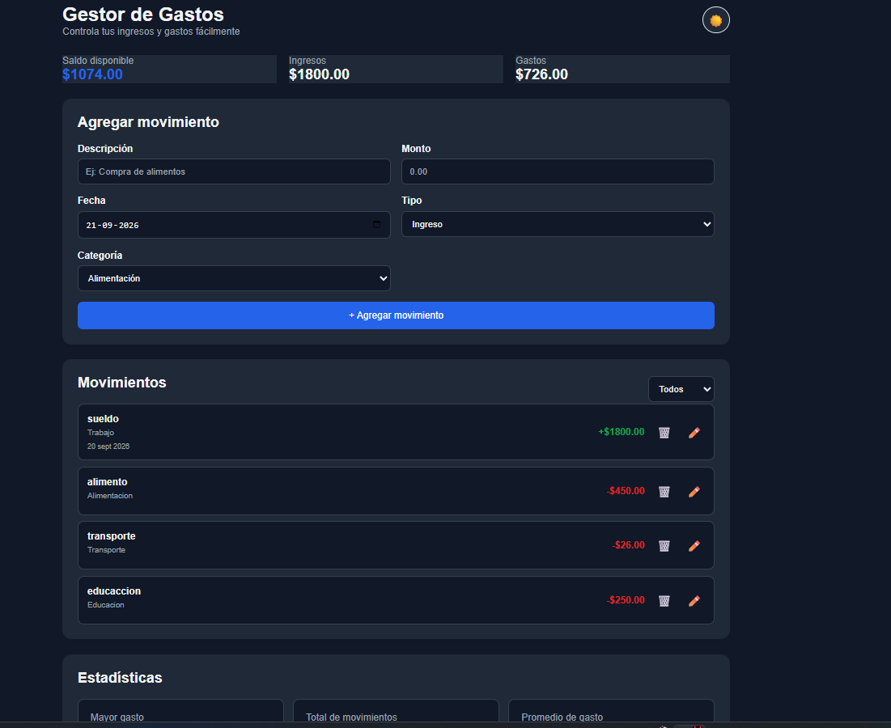

💰 Gestor de Gastos

Este es un proyecto web que hice para llevar un mejor control de los ingresos y gastos.
Captura del proyecto



# ¿Para qué sirve?

La aplicación permite registrar los ingresos y gastos, ver cuánto dinero queda disponible y revisar en qué se está gastando.

También muestra algunas estadísticas para tener una visión más clara de los movimientos registrados.

# Funciones

- Agregar ingresos y gastos.
- Elegir una categoría para cada movimiento.
- Registrar la fecha.
- Editar movimientos.
- Eliminar movimientos.
- Filtrar los movimientos.
- Ver el saldo disponible.
- Ver el total de ingresos y gastos.
- Ver el mayor gasto.
- Calcular el promedio de gastos.
- Ver los gastos separados por categoría.
- Guardar los datos en el navegador usando `localStorage`.
- Cambiar entre modo claro y modo oscuro.

# Tecnologías

- HTML
- CSS
- JavaScript
- LocalStorage

# ¿Cómo usarlo?

1. Seleccionar si se quiere agregar un ingreso o un gasto.
2. Escribir una descripción.
3. Ingresar el monto.
4. Seleccionar una categoría.
5. Elegir la fecha.
6. Presionar el botón **Agregar movimiento**.
7. El movimiento aparecerá en el historial.

Los datos se guardan automáticamente en el navegador, por lo que no se pierden al cerrar la página.

# Ejecución

El proyecto se puede abrir directamente desde el navegador.

También cuenta con una versión publicada mediante GitHub Pages.

# Estructura del proyecto

```text
GESTOR DE GASTOS/
├── index.html
├── README.md
├── css/
│   └── style.css
└── js/
    └── app.js

    Autor

Darlyn Alberto Lara